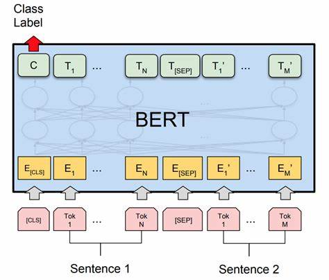
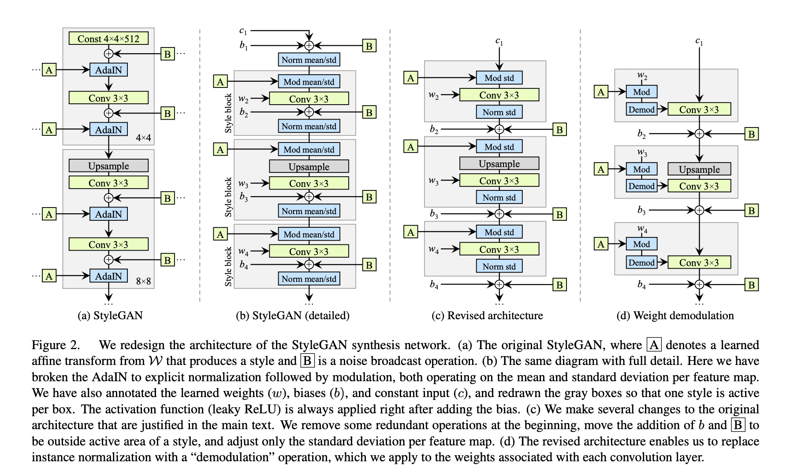
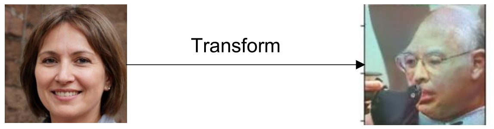

# Graduation Project: Text-to-Face Synthesis

This project aims at building an integrated model to process text and generate corresponding face images that satisfy the descriptions in the input text.

## Components

### Text Classification Model
A text classification model based on **BERT (Bidirectional Encoder Representations from Transformers)** was developed to encode the input text into a compact representation[1].

BERT Architecture.

### Image Generation Model
The **StyleGAN2** architecture was employed for unconditional image generation, producing initial face images.

This is the StyleGAN2 network architecture used in our project[2].

### Image Encoding Model
A **ResNet50** model was used to encode the generated images into a compact representation, matching the dimensionality of the text encoding.[3]

ResNet50 Architecture.

### Logistic Regression Model
A logistic regression model was trained to map the noise input to StyleGAN2 (latent space) to the predicted labels from the text classifier. By adjusting the noise along the dimensions corresponding to the desired labels, new images satisfying the text description could be generated.

## Monitoring System
As a practical application, a monitoring system was developed to detect faces in a video feed using **Haar Cascade Face Detection**, encode the detected faces using ResNet50, and compare them against text descriptions (e.g., of a criminal or missing person)[4].

## Key Results
The report presents evaluation metrics such as **AUC-ROC** and visual examples of generated face images corresponding to input text descriptions.

Output for the Text "He's a bald old man wearing eyeglasses".

## Conclusion
The project demonstrates the integration of multiple deep learning models for the novel task of text-to-face synthesis, with potential applications in security and surveillance domains.

## References:
**[1]** Devlin, J., Chang, M.W., Lee, K. and Toutanova, K., 2019. BERT: Pre-training of deep bidirectional transformers for language understanding. arXiv preprint arXiv:1810.04805.

**[2]** Karras, T., Laine, S., Aittala, M., Hellsten, J., Lehtinen, J. and Aila, T., 2020. Analyzing and improving the image quality of stylegan. In Proceedings of the IEEE/CVF Conference on Computer Vision and Pattern Recognition (pp. 8110-8119).

**[3]** He, K., Zhang, X., Ren, S. and Sun, J., 2016. Deep residual learning for image recognition. In Proceedings of the IEEE conference on computer vision and pattern recognition (pp. 770-778).

**[4]** Viola, P. and Jones, M., 2001. Rapid object detection using a boosted cascade of simple features. In Proceedings of the 2001 IEEE Computer Society Conference on Computer Vision and Pattern Recognition. CVPR 2001 (Vol. 1, pp. I-I). IEEE.